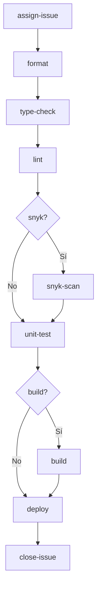

<!-- NTT DATA Logo -->
<p align="right"></p>

# React CI/CD Reusable Workflow

**Archivo fuente:** `.github/workflows/react-cicd-reusable-dev.yml`

---

## Descripción
Workflow reusable para CI/CD de proyectos React. Permite ejecutar jobs condicionales de formateo, análisis de tipos, lint, escaneo de seguridad, pruebas unitarias, build y despliegue, con manejo automatizado de issues.

## Inputs

| Nombre        | Tipo   | Requerido | Descripción                         |
|-------------- |--------|-----------|-------------------------------------|
| branch        | string | Sí        | Rama objetivo del workflow          |
| apply-test    | string | Sí        | Ejecutar tests unitarios (Sí/No)    |
| apply-snyk    | string | Sí        | Ejecutar análisis Snyk (Sí/No)      |
| apply-build   | string | Sí        | Ejecutar build (Sí/No)              |
| apply-deploy  | string | Sí        | Ejecutar deploy (Sí/No)             |
| issue-id      | string | Sí        | ID del issue relacionado            |
| creator       | string | Sí        | Usuario que dispara el workflow     |

## Outputs

No aplica outputs explícitos; el workflow actualiza el estado del issue y realiza despliegue si corresponde.

## Jobs

| Job           | Descripción                                                                                 |
|---------------|--------------------------------------------------------------------------------------------|
| assign-issue  | Asigna el issue y comenta el inicio (usa `actions/github-script`).                         |
| format        | Formatea el código (`npm run format`).                                                     |
| type-check    | Revisa tipos con Flow (`npm run flow`).                                                    |
| lint          | Linter de código (`npm run lint`).                                                         |
| snyk-scan     | Análisis de seguridad con Snyk (opcional, depende de input).                               |
| unit-test     | Ejecuta tests unitarios (opcional, depende de input y Snyk).                               |
| build         | Compila la app (opcional, depende de input y Snyk/tests).                                  |
| deploy        | Despliega a GitHub Pages (opcional, depende de input y build).                             |
| close-issue   | Comenta el resultado y cierra el issue si todo fue exitoso.                                |

## Diagrama de flujo



## Uso

Este workflow debe ser llamado desde otro workflow usando `workflow_call` y pasando los inputs requeridos. Ejemplo:

```yaml
jobs:
	call-react-cicd:
		uses: ./.github/workflows/react-cicd-reusable-dev.yml
		with:
			branch: main
			apply-test: 'Sí'
			apply-snyk: 'No'
			apply-build: 'Sí'
			apply-deploy: 'No'
			issue-id: '123'
			creator: 'usuario'
```

## Versionado

- Última actualización: 19 de febrero de 2026

---
<p align="center"></p>
